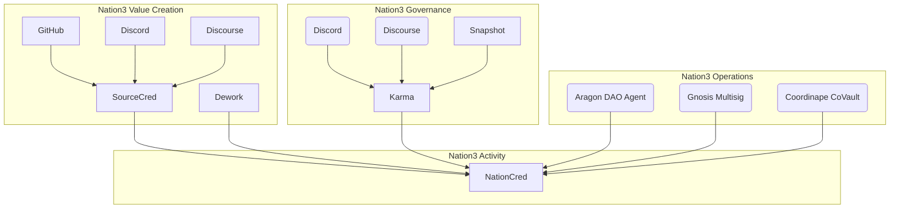

# NationCred Datasets

Current and historical NationCred scores

## Data Sources

A Nation3 citizen's NationCred score is based on multiple data sources:

See [`data-sources/`](data-sources/)

## NationCred

See [`nationcred/`](nationcred/)
